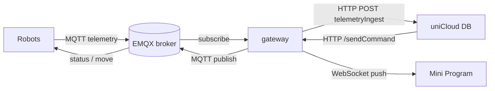

# ECS · IoT Gateway

Python services that connect a fleet of remote-controlled robots to a WeChat Mini Program backend. Robots speak MQTT, the backend speaks HTTP, and the app wants real-time data. The gateway sits in the middle and handles all three.



## Repository layout

| Directory | Status | Role |
| :-- | :-- | :-- |
| [`gateway/`](gateway/) | **Production** | Single process that merges the two bridges below and adds WebSocket push. Deployed on Render. |
| [`command-bridge/`](command-bridge/) | Legacy | Downlink only: HTTP command → MQTT publish. |
| [`mqtt-bridge/`](mqtt-bridge/) | Legacy | Uplink only: MQTT telemetry → uniCloud over HTTP with retries. |
| [`mqtt_ingestor/`](mqtt_ingestor/) | Prototype | Minimal subscriber used to validate the broker and payload format. |

## Gateway at a glance

| Endpoint | Purpose |
| :-- | :-- |
| `POST /sendCommand` | Validates `x-command-token`, normalises the command, publishes to `{prefix}/status` or `{prefix}/move`. |
| `GET /healthz` | Reports MQTT connection state and connected WebSocket clients. |
| `WS /ws?token=…` | Streams telemetry to the app; answers `ping` with `pong`. |

Design choices worth knowing:

- **Signed, expiring WebSocket tokens.** Tokens take the form `uid:expiry_ms:signature`, where the signature is HMAC-SHA256 issued by a cloud function. Comparisons are constant-time.
- **Bounded resources.** A capped client pool, a per-message size limit on inbound WebSocket frames, and a bounded telemetry queue keep one misbehaving client from starving the rest.
- **Deduplication before write.** Identical telemetry inside a TTL window is dropped before it reaches the database or the app.
- **Decoupled ingest.** MQTT callbacks only enqueue; a worker thread writes to the database with retries and broadcasts, so slow HTTP never blocks the MQTT loop.
- **Stable error codes.** `4001`–`4004` for client errors and `5001`–`5002` for broker failures.

## Getting started

Full setup, configuration reference, and end-to-end test steps are in [`gateway/README.md`](gateway/README.md).

```bash
cd gateway
python3 -m venv .venv && source .venv/bin/activate
pip install -r requirements.txt
cp .env.example .env   # fill in broker and token settings
python3 main.py
```

Security and load checks (auth, validation, oversized payloads, heartbeat, concurrent and max connections) live in [`gateway/test_security.py`](gateway/test_security.py).

## Stack

Python · Flask · flask-sock · paho-mqtt · EMQX · uniCloud · Render
